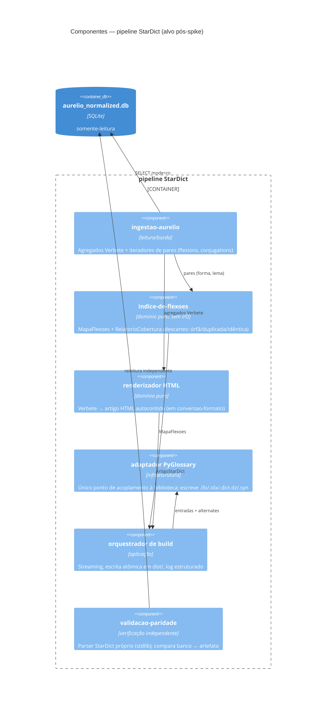

# C4 Nível 3 — Componentes do pipeline StarDict (planejado)

> Gerado pelo reversa-architect em 2026-07-03. Todo o nível é 🟡 PLANEJADO (specs SDD §8 de cada componente); as fronteiras vêm dos decision logs, não de código.

## Contratos entre componentes (das specs)

| Produtor → Consumidor         | Estrutura                                                                                         | Spec                             |
| ----------------------------- | ------------------------------------------------------------------------------------------------- | -------------------------------- |
| ingestao → indice-de-flexoes  | iteradores `(entry_head, flexion)` e `(infinitive, conjugation)`                                  | `sdd/indice-de-flexoes.md` RF-01 |
| indice-de-flexoes → conversao | `MapaFlexoes {entradas: [(forma, headword)]}` + `RelatorioCobertura`                              | `sdd/indice-de-flexoes.md` §9    |
| conversao → validacao         | `ResultadoBuild {headwords, sinonimos, duracao_s, arquivos}` + diretório `dist/aurelio-stardict/` | `sdd/conversao-formato.md` §9    |

## Relação com o spike (S-01)

O spike implementa versões **inline e descartáveis** de `ing`+`mapa`+`adapt` num único script, sem criar estes componentes — deliberado (D-04 do roadmap da feature 001) para não investir antes do gate.
