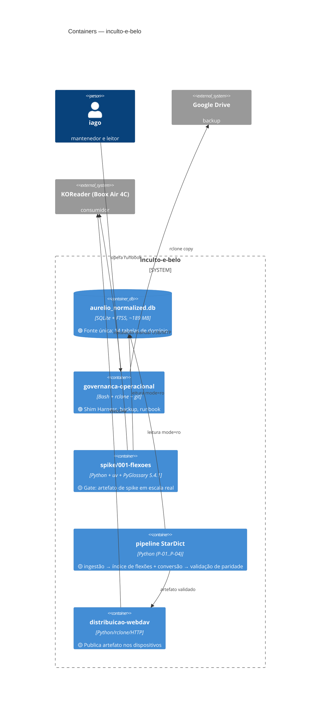

# C4 Nível 2 — Containers

> Gerado pelo reversa-architect em 2026-07-03. 🟢 existente, 🟡 planejado pelas specs SDD.

## Notas

- 🟡 O container `pipeline` só nasce após veredito GO do spike (ADR-0005); suas fronteiras internas estão no nível 3 (`c4-components.md`).
- 🟢 Não há serviço residente: todos os containers são processos sob demanda do mantenedor.
