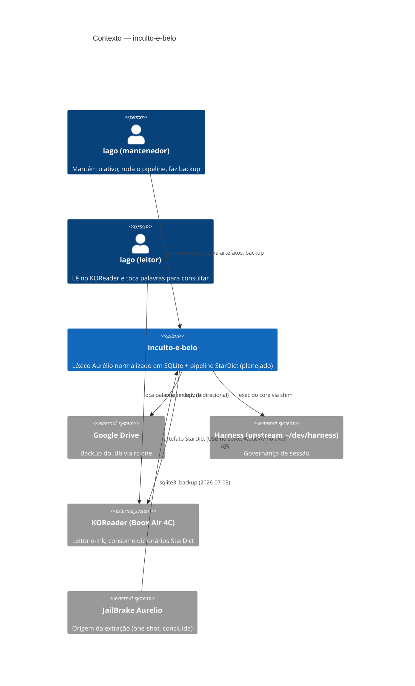

# C4 Nível 1 — Contexto

> Gerado pelo reversa-architect em 2026-07-03. 🟢 existente, 🟡 planejado.

## Leitura

- O sistema não expõe serviço algum: tudo é local e offline; as fronteiras externas são armazenamento (Drive), governança (Harness) e o consumidor final (KOReader).
- A única integração nova prevista pelas specs é a distribuição WebDAV (`sdd/distribuicao-webdav.md`), que reutiliza infraestrutura já existente do ecossistema `koreader-notas` do mantenedor. 🟡
