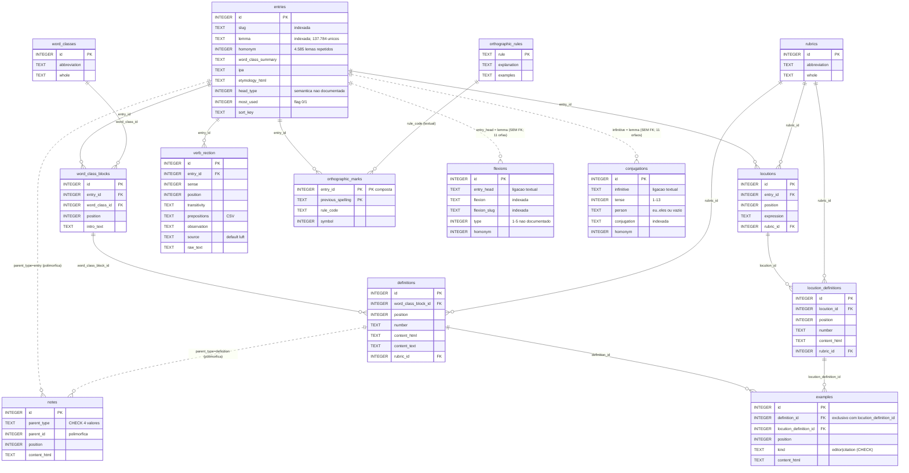

# ERD completo — aurelio_normalized.db

> Gerado pelo reversa-architect em 2026-07-03 a partir do DDL real. 🟢 CONFIRMADO.
> Linhas tracejadas conceituais: ligações **textuais sem FK** (integridade por convenção).

## Cardinalidades e volumes

| Relação                         | Cardinalidade | Volume médio                                 |
| ------------------------------- | ------------- | -------------------------------------------- |
| entries → word_class_blocks     | 1:N           | 1,17 blocos/verbete (168.361/143.376)        |
| word_class_blocks → definitions | 1:N           | 1,54 acepções/bloco (259.337/168.361)        |
| definitions → examples          | 1:N esparso   | 54.726 exemplos p/ 259.337 acepções          |
| entries → locutions             | 1:N esparso   | 22.168 locuções                              |
| entries ⇢ flexions              | 1:N textual   | 175.259 formas                               |
| entries ⇢ conjugations          | 1:N textual   | 869.119 formas (~12.972 verbos × ~67 formas) |

## FTS5 (fora do ERD relacional)

`fts_entries` (lemma/slug/classe) e `fts_definitions` (content_text) são tabelas virtuais **external content** apontando para `entries` e `definitions` via `content_rowid` — dependem do mesmo arquivo e quebram em cópias parciais.
