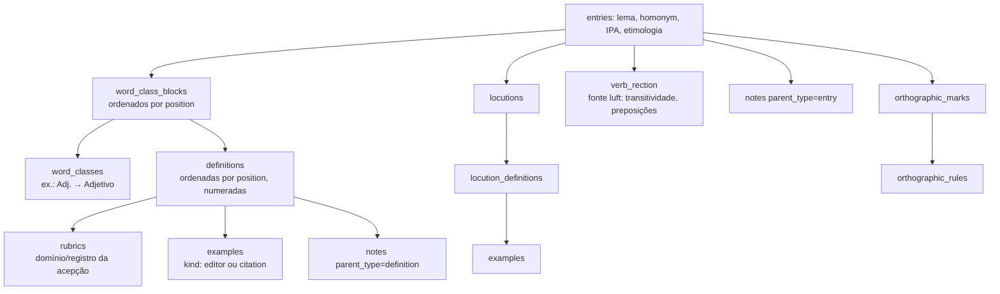
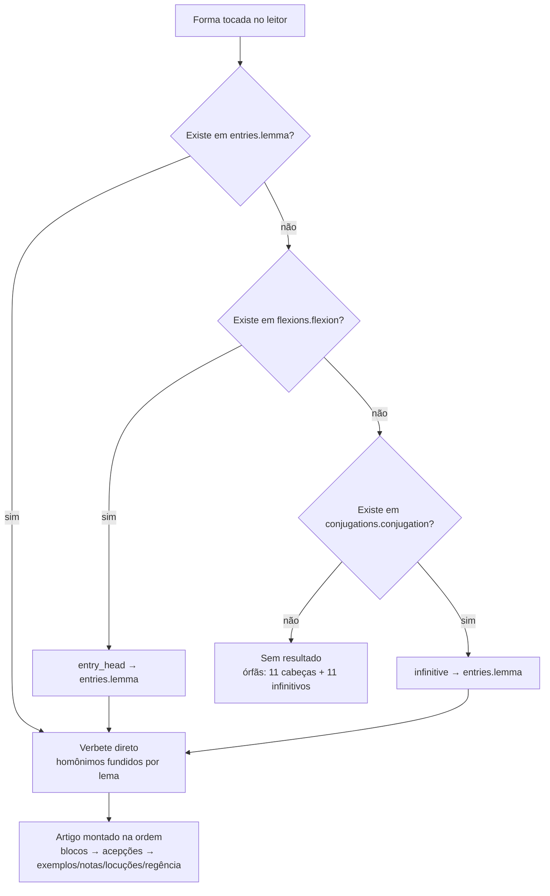
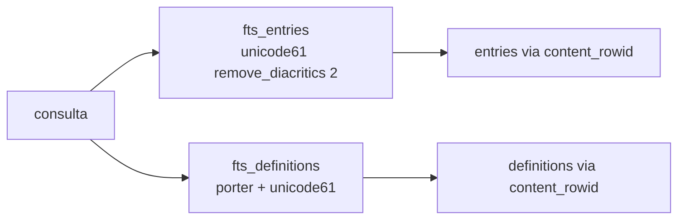

# Flowchart — módulo `banco-lexical`

> Gerado pelo reversa-archaeologist em 2026-07-03. O módulo é dado puro; os fluxos abaixo descrevem (1) a composição de um verbete e (2) o lookup de leitura que o pipeline forward materializará em StarDict.

## 1. Composição de um verbete completo

## 2. Lookup de uma forma tocada (fluxo-alvo do produto)

⚠️ As ligações `flexions.entry_head ↔ entries.lemma` e `conjugations.infinitive ↔ entries.lemma` são **textuais, sem FK** — a resolução de órfãs é responsabilidade de quem consome.

## 3. Busca textual (FTS5)

