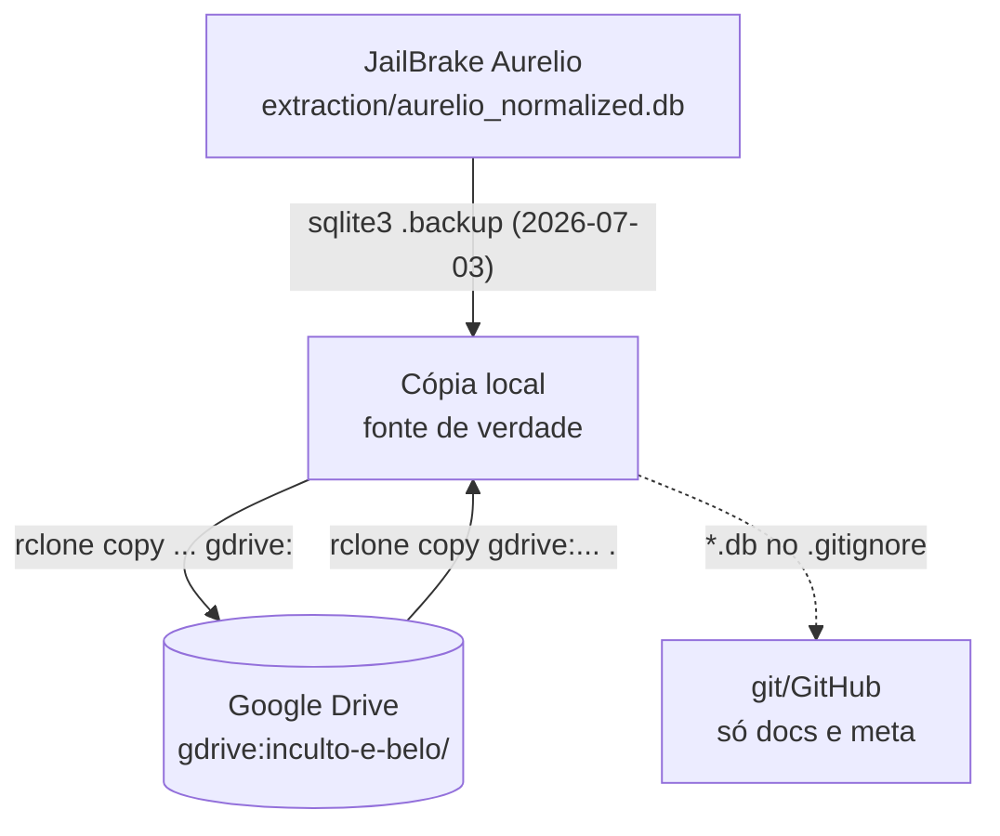
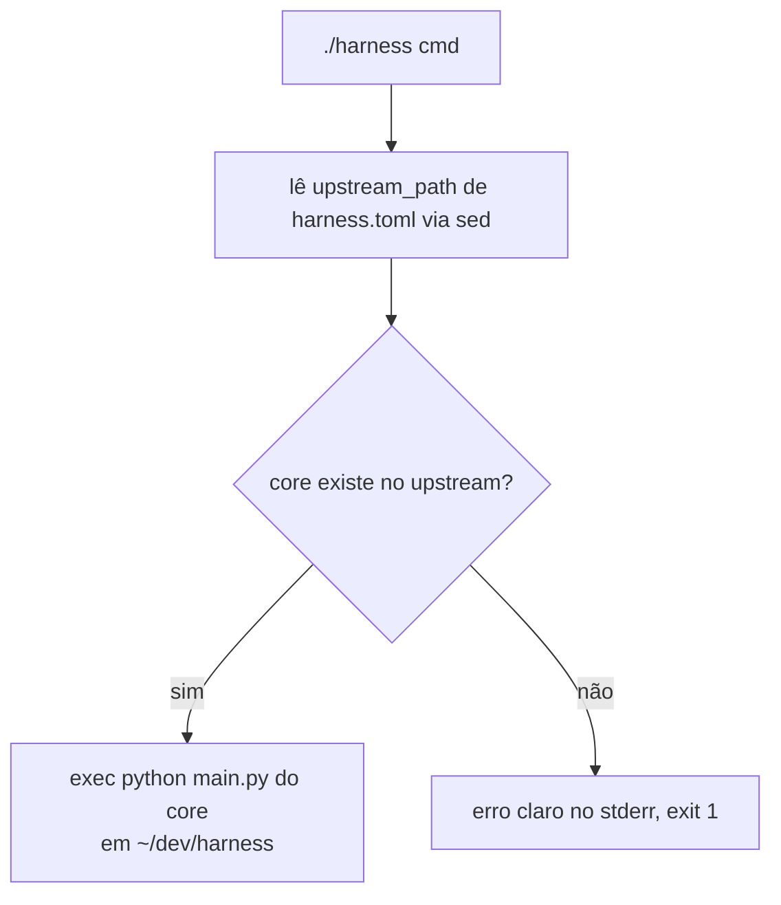

# Flowchart — módulo `governanca-operacional`

> Gerado pelo reversa-archaeologist em 2026-07-03.

## 1. Ciclo de vida do ativo de dados

## 2. Shim do Harness

Risco operacional mapeado: backup único no Drive; sem verificação automática de integridade pós-restauração (runbook manual no README).
