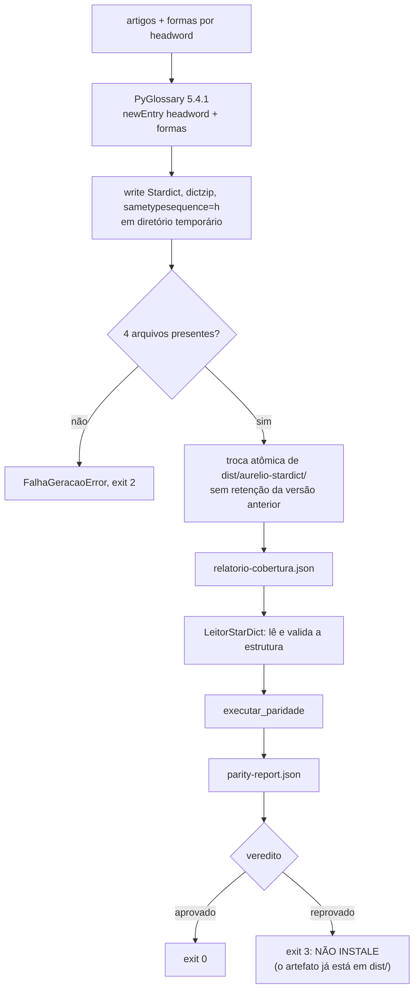
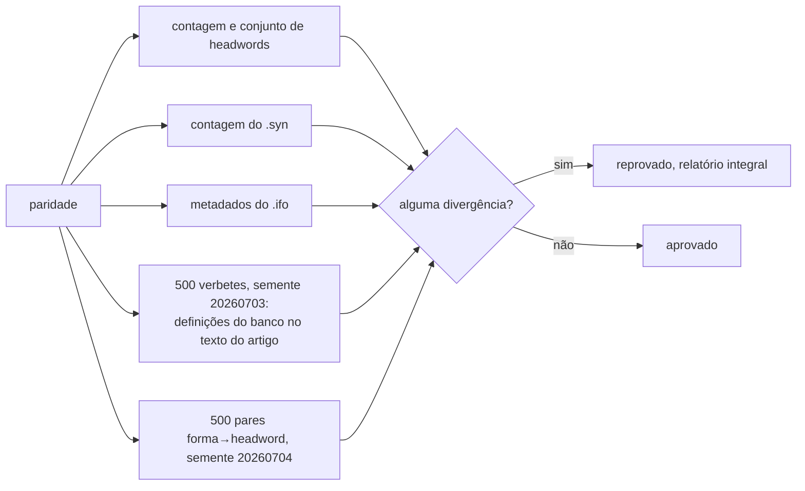

# Flowchart — módulo `pipeline-koreader`

> Gerado pelo reversa-archaeologist em 2026-10-15.

## 1. Alvo KOReader (`_alvo_koreader`)

```mermaid
flowchart TD
    A[artigos + formas por headword] --> G[PyGlossary 5.4.1<br/>newEntry headword + formas]
    G --> W[write Stardict, dictzip, sametypesequence=h<br/>em diretório temporário]
    W --> F{4 arquivos presentes?}
    F -- não --> FG[FalhaGeracaoError, exit 2]
    F -- sim --> T[troca atômica de dist/aurelio-stardict/<br/>sem retenção da versão anterior]
    T --> RC[relatorio-cobertura.json]
    RC --> L[LeitorStarDict: lê e valida a estrutura]
    L --> P[executar_paridade]
    P --> PR[parity-report.json]
    PR --> V{veredito}
    V -- aprovado --> OK[exit 0]
    V -- reprovado --> R3["exit 3: NÃO INSTALE<br/>(o artefato já está em dist/)"]
```

## 2. Checks da paridade

```mermaid
flowchart LR
    P[paridade] --> C1[contagem e conjunto de headwords]
    P --> C2[contagem do .syn]
    P --> C3[metadados do .ifo]
    P --> C4[500 verbetes, semente 20260703:<br/>definições do banco no texto do artigo]
    P --> C5[500 pares forma→headword, semente 20260704]
    C1 & C2 & C3 & C4 & C5 --> D{alguma divergência?}
    D -- sim --> R[reprovado, relatório integral]
    D -- não --> A[aprovado]
```
