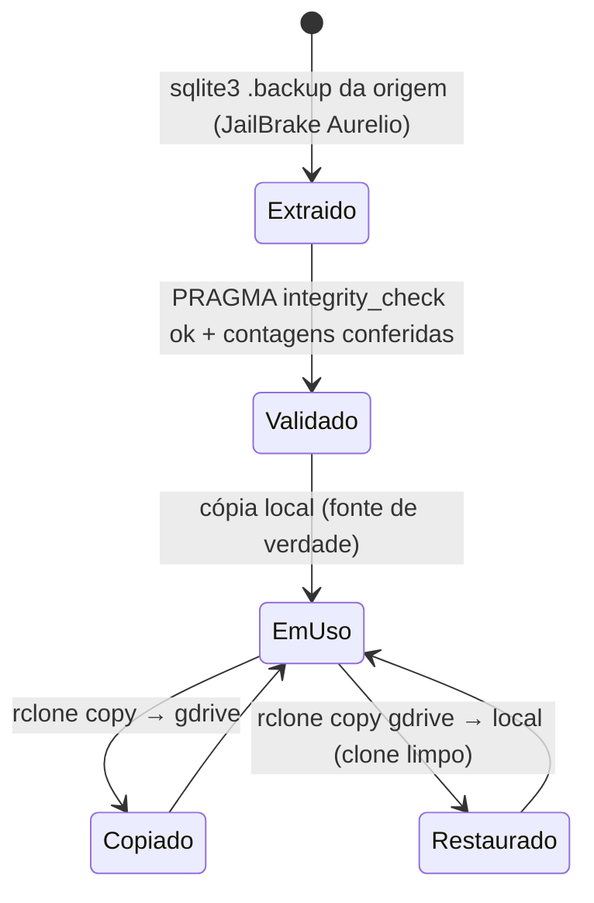
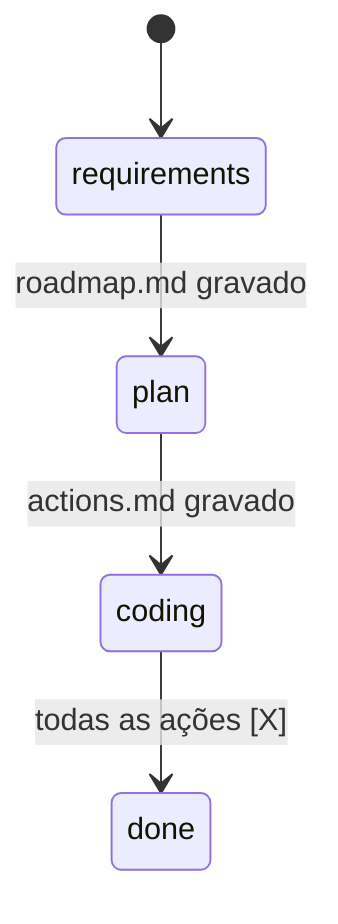

# Máquinas de estado — inculto-e-belo

> Gerado pelo reversa-detective em 2026-07-03

## Veredito

🟢 **Nenhuma entidade do banco possui campo de status ou transições de estado.** O dado é um snapshot editorial estático: verbetes, acepções e formas não mudam de estado — mudam, no máximo, de versão quando o banco inteiro for regenerado a partir da origem.

As únicas dinâmicas de estado do projeto são **operacionais**, e ficam registradas aqui por completude:

## 1. Ciclo de vida do ativo `aurelio_normalized.db`

🟡 Não há verificação automática pós-restauração; o runbook do README é manual (risco registrado em `dependencies.md`).

## 2. Ciclo forward da feature ativa (governança Reversa, não dado)

🟢 Estado atual da feature `001-spike-de-flexoes`: `coding` pendente (actions.md com 13 ações abertas), aguardando esta extração para destravar o gate do `/reversa-coding`.
